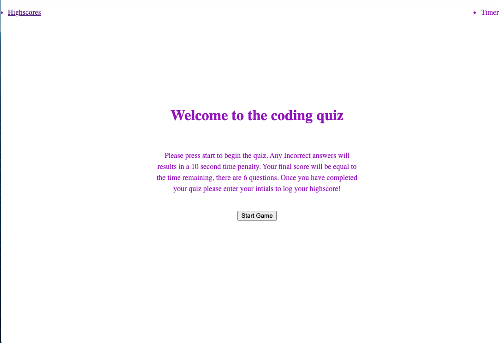
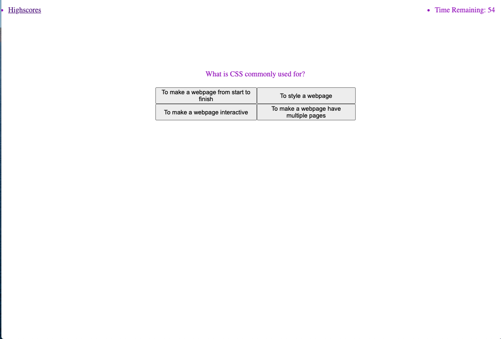
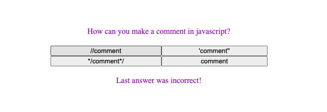
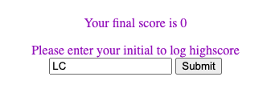
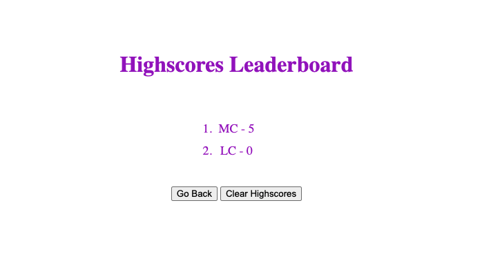

# 03 JavaScript: Password Generator

## The Project

For this project we had to create a timed coding quiz with multiple-choice questions.

The quiz needs to feature a start button which when clicked a timer starts and the user is presented with a question. When the question is answered then another question should appear. When a question is answered incorrectly, time should be subtracted from the clock. When either all the questions are answered or the timer reaches 0, the quiz is over. When the game is over the user should be able to save their initials with their score.

## Mockup

## Finished Product

> **Note** : This shows the landing page.

> **Note** : This shows one of the questions.

> **Note** : This shows wether the last answer was correct.

> **Note** : This shows where you log your score.

> **Note** : This shows the highscore leaderboard.

## A link to the webpage is shown below:
https://lconnell1000.github.io/codingQuiz/